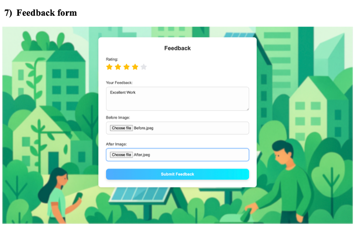

# City Wellness – Smart Reporting and Monitoring System

A full-stack smart city web application that enables citizens to report waste-related issues using AI-powered waste classification, real-time geolocation, and media uploads. Built as a BCA final-year project to improve urban hygiene, transparency, and municipal response efficiency.

---

## 🚀 Features

- 📸 **Waste Reporting** — Citizens can report waste with image uploads, live GPS location, and optional voice messages.
- 🧠 **AI Waste Classification** — Integrated a TensorFlow CNN model to classify waste into Organic, Metal, or Glass and assign severity (Low/Medium/High).
- 🔐 **Authentication** — Secure Google login for users and role-based access for admins via Firebase Authentication.
- 📊 **Admin Dashboard** — Real-time dashboard to monitor complaints, reports, feedback, and assign cleanup actions.
- 💬 **Feedback & Complaints** — Supports rating, image comparisons, and escalations if issues are not resolved.
- 🌐 **Geolocation + Voice** — Captures location coordinates and allows audio input for richer reporting.
- 📈 **Analytics** — Predictive insights using historical data to help authorities optimize waste collection schedules.

---

## 🛠️ Tech Stack

| Layer       | Technology Used                          |
|-------------|-------------------------------------------|
| Frontend    | React.js, HTML5, CSS3, JavaScript         |
| Backend     | Node.js, Express.js, Flask (Python)       |
| Database    | MongoDB (with Mongoose), Firebase Realtime DB |
| AI/ML       | TensorFlow, Keras (CNN Model)             |
| Auth        | Firebase Authentication (Google OAuth)    |
| Dev Tools   | Git, GitHub, VS Code, Postman             |
| APIs        | Google Maps API, Web Audio API, Geolocation API |

---

## 📷 Screenshots

### 🖥️ Admin Dashboard


### 📝 Waste Report Form


### 🧠 AI Prediction Result


### 🌟 Feedback Form with Ratings


---

## 📦 Installation

### 🔧 Prerequisites

- Node.js (v18+)
- Python (v3.8+)
- MongoDB
- Firebase account
- Git

### 🖥️ Backend Setup (Node + Flask)

1. Clone the repository:
   ```bash
   git clone https://github.com/Tasneemgokak/SmartCitywellness.git
   cd SmartCitywellness
   ```

2. Navigate to Flask backend:
   ```bash
   cd ml-model
   pip3 install -r requirements.txt
   python3 app.py
   ```

3. Navigate to Express backend:
   ```bash
   cd backend
   node server.js
   ```

### 🌐 Frontend Setup

```bash
cd frontend
npm install
npm start
```

---

## 📂 Project Structure

```
SmartCitywellness/
│
├── frontend/              # React UI with reporting, feedback, admin panel
├── backend/               # Node.js + Express REST API
├── ml-model/              # Flask server with ML model (TensorFlow)
└── README.md              # Project documentation
```

---

## 🧠 AI Model

- Built using TensorFlow + Keras
- Convolutional Neural Network (CNN)
- Trained to classify waste as Organic, Metal, or Glass
- Returns severity classification (Low/Medium/High)

---

## ✅ Testing

- Unit Testing (React Components, API routes, AI model)
- Integration Testing (Frontend ↔ Backend ↔ ML)
- Security Testing (Firebase Auth, route protection)
- Performance Testing (image upload, model inference speed)

---

## 👨‍💻 Authors

- [Tasneem Gokak] -> https://github.com/Tasneemgokak  
- [Musaddiqua rajannavar] -> https://github.com/Musaddiqua
- [Mohammed Shoaib M] -> https://github.com/MaDycloud-MD

---

## 🙌 Acknowledgements
- Inspiration: Smart Cities Mission, India
